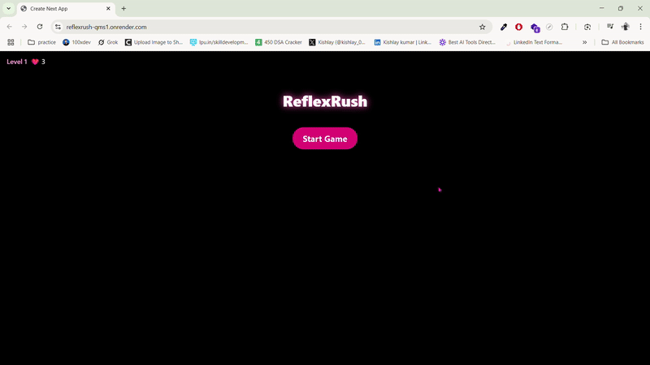

# ReflexRush 🎯



**ReflexRush** is a fast-paced reflex game built with **Next.js**, **Tailwind CSS**, and **Framer Motion**.  

Your goal? Tap the glowing circle before it vanishes.

As your score increases, the speed gets more brutal — and the stakes get higher. Lose all your lives, and it’s game over.

---

## 🚀 Live Demo

👉 [https://reflexrush-qms1.onrender.com](https://reflexrush-qms1.onrender.com)

---

## 🛠️ Tech Stack

- ⚛️ Next.js (App Router)
- 💅 Tailwind CSS
- 🎞️ Framer Motion for animation
- 📦 Pure frontend – no backend or auth
- 💾 High score stored via LocalStorage

---

## 📱 Features

- Clean responsive UI for mobile & desktop
- Glowing circles spawn at random spots
- Miss a circle = lose a life
- Speed increases as you level up
- Lives & restart system
- Celebration when beating your own high score 🎉

---

## 🧠 Want to Contribute?

This project is **open for contributions**. You can improve or extend the game by:

- Adding sound effects 🔊  
- Countdown timer before starting ⏳  
- Fullscreen toggle 📱  
- Leaderboard mode 🏆  
- Power-ups, skins, dark/light themes, etc.

Feel free to fork, open issues, and suggest enhancements!

---

## 📦 Setup

```bash
npm install
npm run dev
